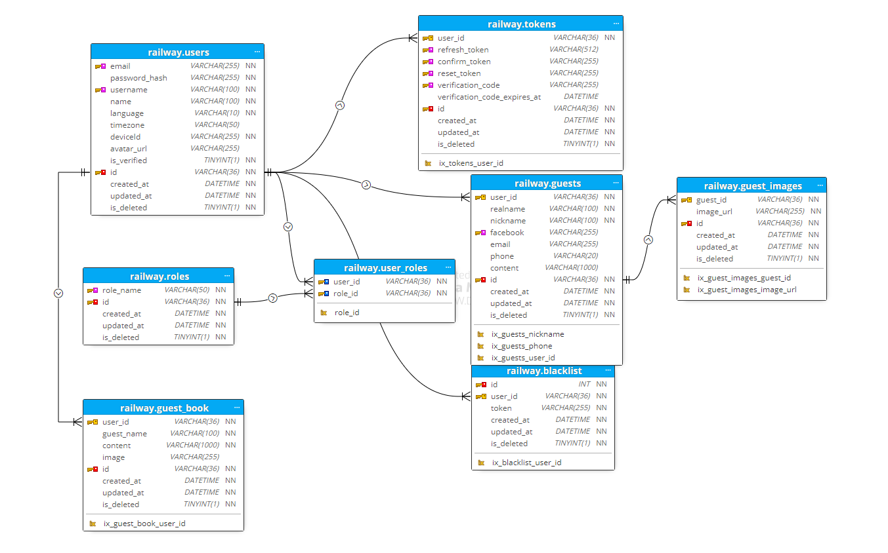

# 🍽 Meal Planner - Cross-platform Application ✨

✨ Meal Planner is a cross-platform application designed to simplify meal planning, grocery shopping, and food management for individuals and families. The app features intuitive interfaces for both system administrators and end users, offering a comprehensive solution for meal organization and grocery tracking.

---

## Features

### 📝 System Admin Interface
- **Category Management**: Create, update, and delete categories.
- **Unit Management**: Manage measurement units for ingredients and recipes.

### 🔨 User Interface
#### 🔐 User Management
- Change password.
- Update and manage personal information, including uploading an avatar.
- Manage groups and family accounts.
- Delete user accounts.

#### 👥 Group-Based Functionality
- **🥒 Food Management**: Track available food items and their statuses.
- **🏡 Fridge Management**: Organize and monitor items in the refrigerator.
- **🏬 Shopping Management**:
  - Shopping lists: Create and organize shopping tasks.
  - Shopping tasks: Assign and track grocery shopping activities.
- **🍔 Meal Planning**: Plan detailed meals for specific days and times.
- **🍲 Recipe Management**: Create, update, and share cooking recipes.

#### 🔑 Authentication
- User registration and login.
- Forgot password functionality with OTP verification.
- Email verification using OTPs sent via email.

---

## 🔧 Technologies Used

### Frontend
- **👾 Dart Flutter**: For cross-platform application development.

### Backend
- **🐛 Flask**: A lightweight WSGI web application framework in Python.
- **🤖 Celery**: For asynchronous task processing.
  - **🛠️ RabbitMQ**: Used as the task queue for Celery.
- **📃 Firebase Object Storage**: For storing user-uploaded images (e.g., avatars).
- **📊 PostgreSQL**: The relational database for data persistence.

---

## 🌍 System Architecture


The architecture consists of the following key components:
1. **📱 Mobile Application**: Interfaces with the server via routers, controllers, and validators.
2. **🛠️ Server**:
   - Handles routing, middleware, and validation logic.
   - Services interact with repositories for database operations.
   - SQLAlchemy (ORM) is used to manage database entities and operations.
   - Firebase is used for object storage (e.g., user avatars).
3. **🤖 Subprocess**:
   - Asynchronous tasks such as email notifications are managed by Celery and RabbitMQ.
4. **📊 Database**: PostgreSQL for structured data storage.

---

## 📊 Entity Relationship Diagram (ERD)



The ERD provides a detailed view of the database schema, including relationships between key entities such as `User`, `Group`, `Meal Plan`, `Recipe`, `Shopping List`, `Food`, and more.

---

## ⚙️ Installation and Setup

### Prerequisites
- Python (>=3.9)
- PostgreSQL
- RabbitMQ
- Firebase Project Setup

### Backend Setup
1. Clone the repository:
   ```bash
   git clone https://github.com/tonystark2306/mealplanner_group15_2024.1.git
   cd server
   ```

2. Create a virtual environment:
   ```bash
   python -m venv venv
   source venv/bin/activate
   ```

3. Install dependencies:
   ```bash
   pip install -r requirements.txt
   ```

4. Configure environment variables:
   - Add `.env` file with the necessary configurations (e.g., database URL, RabbitMQ URL, Firebase credentials) following `.env.example`.

5. Run database migrations:
   ```bash
   flask db upgrade
   ```

6. Start the Flask server:
   ```bash
   python run.py
   ```

### Celery Worker
Start the Celery worker:
```bash
celery -A app.celery worker --loglevel=info
```

### Frontend Setup
1. Install dependencies:
   ```bash
   flutter pub get --no-example
   ```

2. Run the application on the web environment:
   ```bash
   flutter run -d edge --web-renderer html
   ```
---

## Run Application Using Docker Compose
If using Docker compose, just only run the command below:
```bash
docker-compose up -d
```
---

## 🔄 Usage
- Launch the application and register as a new user.
- System administrators can manage categories and units through the admin interface.
- End users can create and join family groups, manage meals, recipes, and shopping tasks.